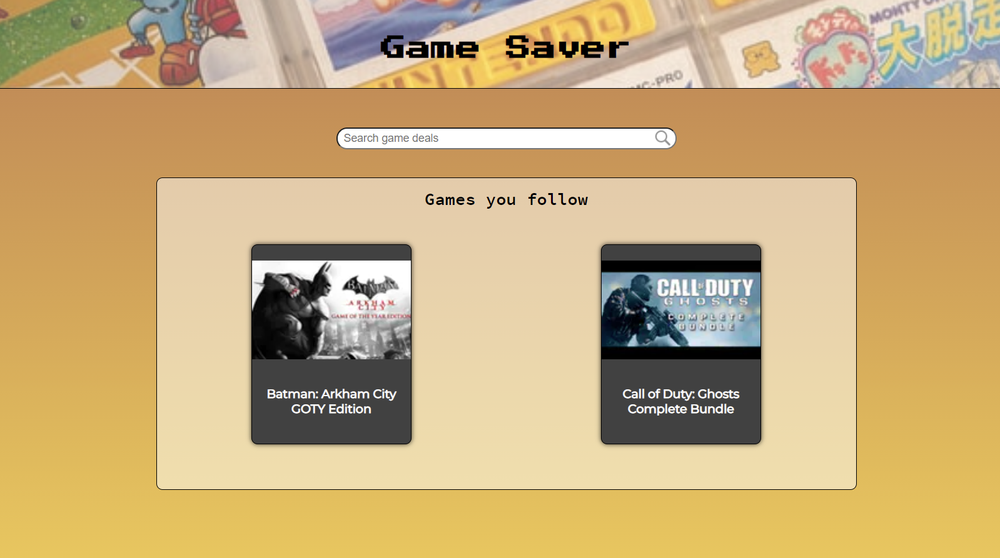

# Using Game Tracker

## What is this app for?
This app is designed for users to quickly check on games they are interested in buying.\
By following a game, it's added to your dashboard, allowing you to check the price in \
numerous online stores where it is sold.\
Below is an example of a users dashboard after a few games have been added.

And here is an example of the display when viewing a game you're following. \
All of the available places to buy the game will be listed below the title card.

[User Library Game](public/user-library-screenshot.png)

Use the search bar beneath the header to look for games to follow. Just a tip, \
you must be following a game to set a price alert!

[Searching for a game to follow](public/global-search-screenshot.png)

While this app does not handle purchasing of games (we link you to sites instead), \
we still value security, therefore all passwords are hashed before they're saved.

##Full Stack Deployment

This application uses a Create-React-App front end as well as a Nodejs \
API and PostgreSQL Database. The github repo for the Node API can be found \
[here](https://github.com/Grandon-Smith/game-tracker-api)